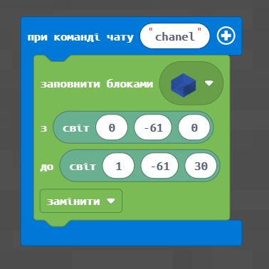
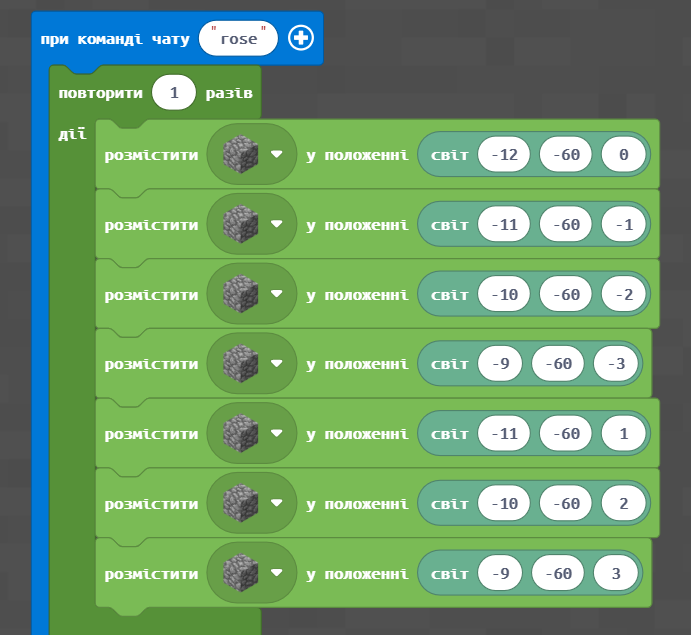
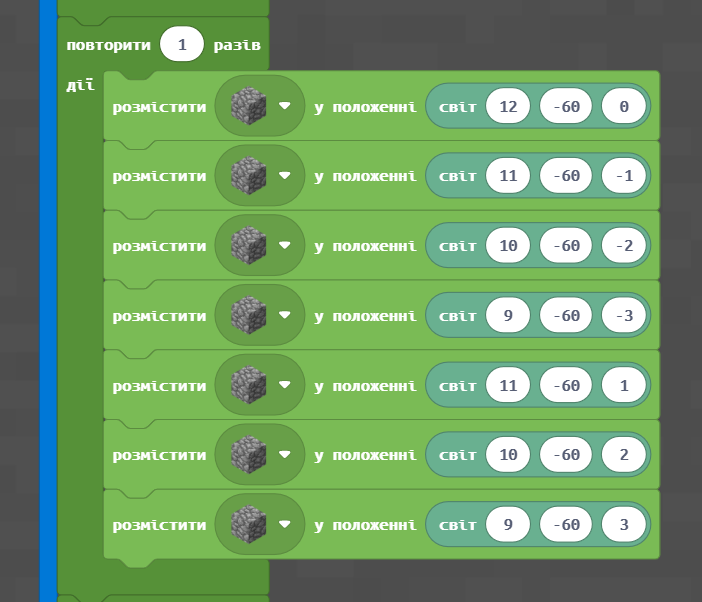
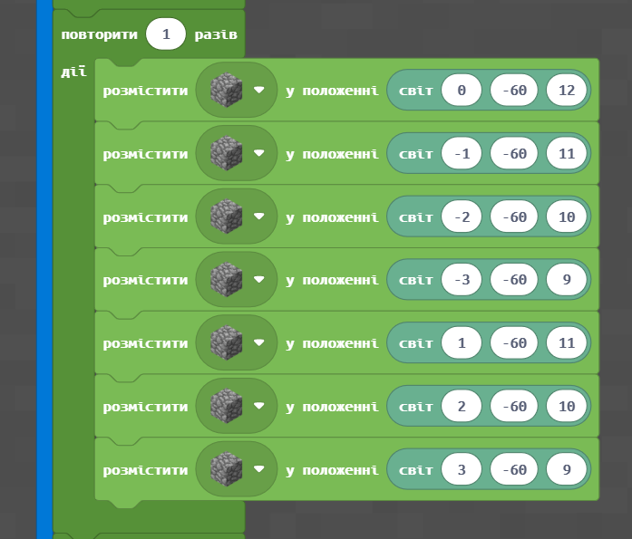
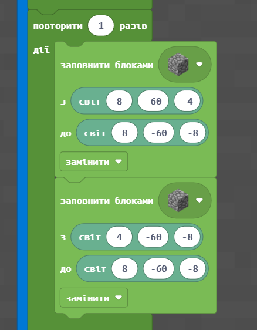
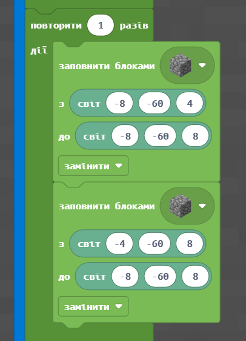
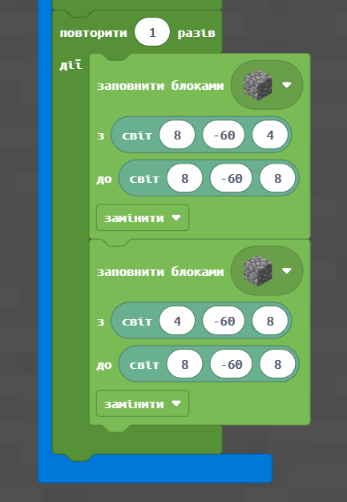
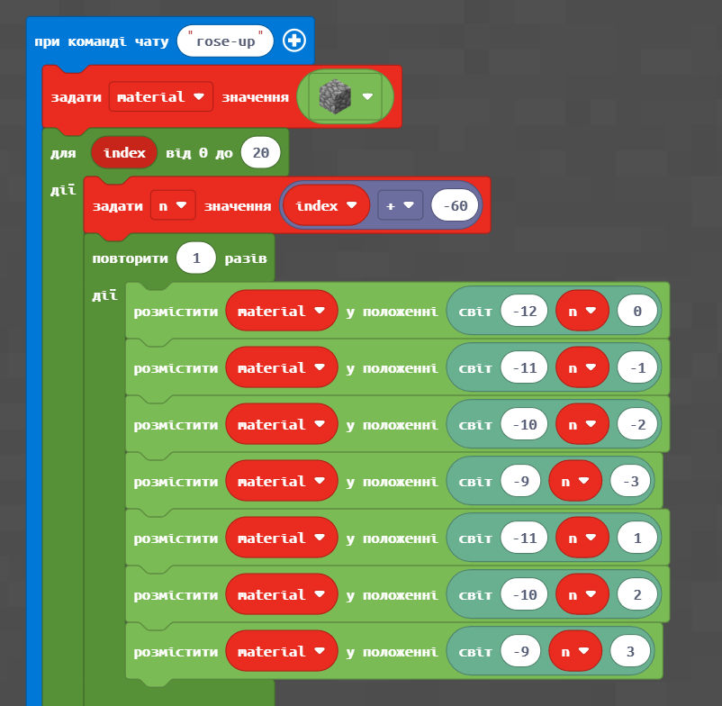
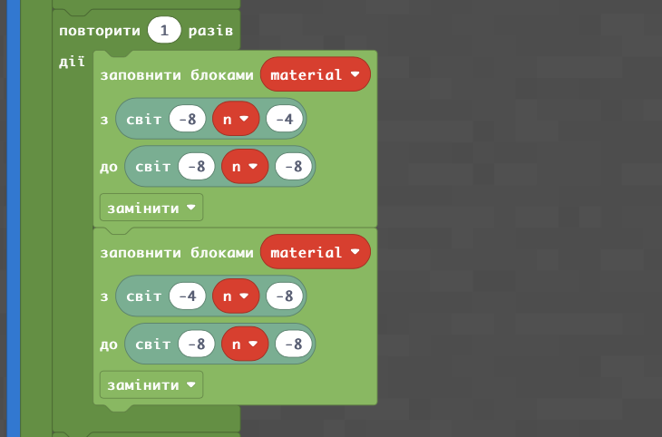

# Роза вітрів

#### Опис


Продовжимо нашу подорож Стародавньою Грецією та знайомство з її культорою. На цьому занятті ми створимо канал, дізнаємося, що таке роза вітрів і зробимо її за допомогою циклів — це буде основа для будівництва дива світу на наступному занятті😉


## Згадаймо🤔

1. Як створити острів у Minecraft?&#x20;
2. Як визначати сторони світла в Minecraft?&#x20;
3. Навіщо потрібен компас?
4. Установіть відповідність між сторонами світла та координатами:

.png>)

## Сьогодні ми:

1. Створимо та осушимо канал в абсолютних координатах.&#x20;
2. Створимо основу рози вітрів.&#x20;
3. Створимо розу вітрів за допомогою циклу.&#x20;

> **Усі ці навички обов'язково знадобляться під час виконання вашого проєкту!**😉

## Основні завдання


Ми продовжуємо подорож Стародавньою Грецією! На минулому занятті ми дізналися, що море було дуже важливим для греків, які поклонялися морському богу Посейдону і вірили, що він допомагає їм у морських подорожах.&#x20;

Щоб трохи приборкати море, греки будували різні канали, і ми сьогодні теж збудуємо один із них.


Як відомо, в Minecraft ми можемо створювати не тільки елементи з твердих матеріалів (дошки, камені тощо), але і створювати **елементи з води**. А якщо після прокладання води той же простір заповнити травою, то ми повернемося до вихідного стану, тобто «осушимо» воду.

| **№**          | **1**                                                                                                                                                                                  |
| -------------- | -------------------------------------------------------------------------------------------------------------------------------------------------------------------------------------- |
| **Завдання:**  | <ol><li>Зробіть водний канал від точки <strong>(0;-61;0)</strong> до точки <strong>(1;-61;30)</strong></li><li>При команді чату <strong>nochannel</strong> — «осушіть» канал</li></ol> |
| **Код:**       | 

                                                                                   |
| **Результат:** | 

                                                                        |

[https://makecode.com/\_bqifJh2LXhDc](https://makecode.com/\_bqifJh2LXhDc)


Чи може бути щось важливіше для стародавнього мореплавця, ніж вітер? Адже саме вітер був важливим помічником будь-якого досвідченого моряка, знаючи його напрямок, капітан безпомилково коригував курс і впевнено вів свій корабель у дальнє плавання.

Стародавні греки вважали, що вітри дмуть із дванадцяти різних напрямків. Трохи пізніше вчений Ератосфен скоротив їх до 8 основних. На основі восьмипроменевої системи Ератосфена була побудована Башта Вітрів, яка є однією з перших метеостанцій та прототипом рози вітрів🌬


## [Роза вітрів](https://makecode.com/\_AeWU9DAE23D9)


Роза вітрів — образна назва картографічного позначення основних географічних азимутів сторін горизонту як зірки з кількістю променів, кратним чотирьом.

.png>)


І сьогодні ми з вами збудуємо таку розу вітрів, яка стане основою для майбутнього дива світу⭐️

| Зробимо 4 діагоналі                                                                                                                                                                             |
| ----------------------------------------------------------------------------------------------------------------------------------------------------------------------------------------------- |
| 
   
     |
| А також 4 лінії, що з'єднуються під прямим кутом:                                                                                                                                               |
| 
    
 |
| В результаті — отримаємо такий елемент в якості рози вітрів:                                                                                                                                    |
| .png>)                                                                                                                                                           |

### ****[**Роза вітрів. Цикл**](https://makecode.com/\_5p615kWWaDbF)****

Для того, щоб цю форму мала не лише лінія висотою в 1 блок, а ціла стіна, додамо змінні та цикли до нашого коду. Продублюємо попередній код.&#x20;

Замінемо повідомлення чату, при якому код буде виконуватися (на **rose-up**). А також додамо елементи, що дозволять нам повторювати відповідний код по елементах, при цьому кожен наступний крок буде піднімати лінію на 1 блок.&#x20;

Розберемо основні рішення такої можливості:

.png>)


**1** — Зробимо можливість змінювати матеріал для побудови.&#x20;

**2** — Повторимо стільки разів, яку висоту хочемо отримати.&#x20;

**3, 6** — додамо можливість будувати не тільки починаючи від висоти 0, але й від будь-якої висоти.&#x20;

**4, 5** — додамо визначні змінні до вже створених елементів (**material** — в позицію, де визначається тим блоків, **n** — де визначається y-координата)


У результаті — отримаємо код, що будує стіну, яка за формою відповідає розі вітрів:

.png>)

.png>)

.png>)

.png>)

.png>)

.png>)

Отримаємо результат:

.png>)

### Очищення поля

Дуже часто необхідно очистити поле, на якому вже побудовано елемент. Наприклад, ви хочете змінити висоту, або матеріал для будівництва. Для цього зручно використовувати розміщення **блоків повітря** на тому місці, яке вже займають блоки побудовної конструкції.

|                                   |                                       |
| --------------------------------- | ------------------------------------- |
| .png>) | .png>) |

## Творчі завдання:

1. Намалюйте за допомогою блоків **першу букву вашого імені**.
2. **Зробіть стіну** заввишки 15 блоків яка за формою відповідає першій літері вашого імені.
3. **Створіть «прибирач»** — набір команд, які витирають створену ваму стіну, що відповідає формі першої літери вашого імені.
4. У центр створеної на занятті рози вітрів **розмістіть компас**, який ви створили на попередньому занятті.

.png>)

&#x20; 5\. Побудуйте розу вітрів з піщаника. Висоту задайте — **10**

&#x20; 6\. Збудуйте аналогійну розу вітрів, але розмір діагональних та прямих елементів зробіть **3** (у прикладі такий розмір — **4**). Матеріал задайте самостійно.&#x20;

Наприклад:

.png>)


На наступному занятті продовжимо подорож Стародавньою Грецією і створимо диво світу! Також ви отримаєте навички, які знадобляться для вашого проєкту.😉

